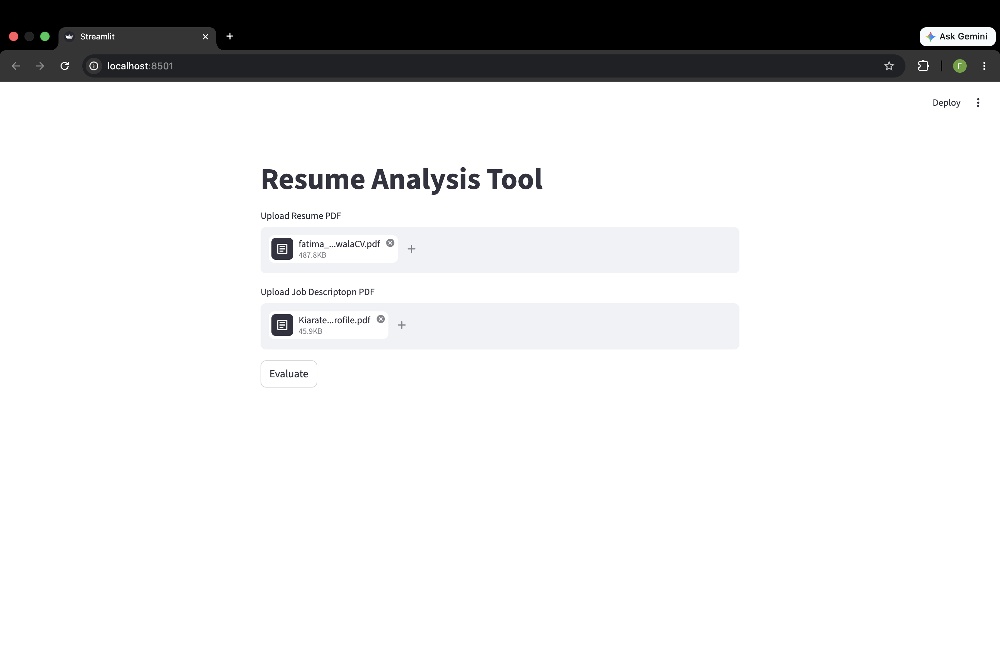
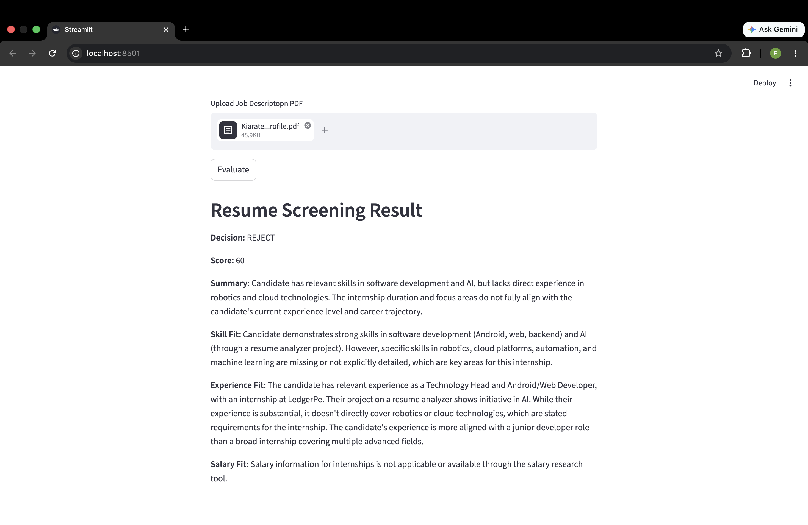

# Resume Analyser Tool

A smart AI-powered **Resume Analysis Tool** built with **Streamlit** that evaluates resumes against job descriptions using **AI/NLP techniques**. Upload a candidate’s resume and a job description PDF to receive an automated screening result with scoring, skill fit analysis, experience matching, and hiring recommendations.

---

## ✨ Features

* 📂 Upload Resume PDF
* 📑 Upload Job Description PDF
* 🤖 AI-powered Resume Screening
* 📊 Resume Match Scoring
* 🧠 Skill Fit Evaluation
* 💼 Experience Fit Analysis
* 📋 Hiring Recommendation
* ⚡ Interactive UI with Streamlit

---

# 🖼️ Demo Screenshots

## Upload Interface

The user uploads:

* Resume PDF
* Job Description PDF

Then clicks **Evaluate** to begin the screening process.



---

## Resume Screening Result

The system generates:

* ✅ Decision (ACCEPT / REJECT)
* 📊 Resume Score
* 🧠 Candidate Summary
* 💼 Skill Fit Analysis
* 📋 Experience Fit Analysis
* 💰 Salary Fit Insights

```md

```

---

# 🛠️ Tech Stack

| Category       | Technology             |
| -------------- | ---------------------- |
| Frontend       | Streamlit              |
| Backend        | Python                 |
| PDF Processing | PyPDF / pdfplumber     |
| AI / NLP       | Gemini API / LangChain |
| Data Handling  | Pandas                 |
| NLP Pipelines  | Scikit-learn           |

---

# 📁 Project Structure

```bash
resume_analyser/
│
├── main.py                     # Main Streamlit application
├── requirements.txt           # Project dependencies
├── .env                       # API keys and environment variables
├── assets/
│   └── screenshots/
│       ├── upload_interface.png
│       └── screening_result.png
│
└── README.md
```

---

# ⚙️ Installation

## 1️⃣ Clone the Repository

```bash
git clone https://github.com/fatimazariwala/resume_analyser.git
cd resume_analyser
```

---

## 2️⃣ Create Virtual Environment

```bash
python3.11 -m venv venv
```

### Activate the Environment

#### Windows

```bash
venv\Scripts\activate
```

#### macOS / Linux

```bash
source venv/bin/activate
```

---

## 3️⃣ Install Dependencies

```bash
pip install -r requirements.txt
```

---

## 4️⃣ Configure Environment Variables

Create a `.env` file in the root directory:

```env
GEMINI_KEY=your_google_gemini_api_key
```

Get your Gemini API key here:

```md
https://aistudio.google.com/app/apikey
```

---

# ▶️ Run the Application

```bash
streamlit run app.py
```

The application will start locally at:

```md
http://localhost:8501
```

---

# 📊 How It Works

1. User uploads a **Resume PDF**
2. User uploads a **Job Description PDF**
3. The system extracts text from both documents
4. AI/NLP compares:

   * Skills
   * Experience
   * Role relevance
   * Keywords
5. A final screening score and recommendation are generated

---

# 📌 Example Output

```yaml
Decision: REJECT
Score: 60

Summary:
Candidate has relevant software development and AI skills
but lacks direct experience in robotics and cloud technologies.

Skill Fit:
Strong in Android, web, backend development, and AI.

Experience Fit:
Relevant software experience but limited alignment
with robotics/cloud-focused internship requirements.
```

---

# 🧠 AI Workflow

The application uses:

* **LangChain Agents**
* **Gemini Models**
* **PDF Parsing**
* **Structured Response Generation**
* **Prompt Engineering**
* **Resume-to-JD Semantic Matching**

---

# 🔮 Future Improvements

* ✅ ATS Compatibility Checker
* ✅ Resume Improvement Suggestions
* ✅ Skill Gap Recommendations
* ✅ Job Role Prediction
* ✅ Multiple Resume Comparison
* ✅ Export Analysis Reports as PDF
* ✅ Candidate Ranking Dashboard

---

# 🤝 Contributing

Contributions are welcome!

### Steps:

1. Fork the repository
2. Create a feature branch

```bash
git checkout -b feature-name
```

3. Commit your changes

```bash
git commit -m "Added new feature"
```

4. Push to your branch

```bash
git push origin feature-name
```

5. Open a Pull Request

---

# 👩‍💻 Author

**Fatima Zariwala**
